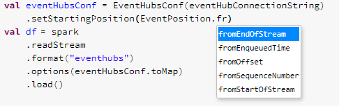

# Databricks Spark Streaming + Event Hubs Integration
In this tutorial, we have given some sample program to connect EventHub from databricks notebook using both way Kafka connector and event hub connector. you will get example for both producer and consumer.


## Prerequisite
* Library

  Install eventhub connector (in case of using eventhub connetcor for streaming)
  ```
  groupId = com.microsoft.azure
  artifactId = azure-eventhubs-spark_2.11
  version = 2.3.17
  
  or
  
  groupId = com.microsoft.azure
  artifactId = azure-eventhubs-spark_2.12
  version = 2.3.17
  ```
  #### How to instal library in databricks.
  * [Create a library](https://docs.databricks.com/libraries/workspace-libraries.html#maven-libraries) in your Databricks workspace using the [Maven coordinate](https://mvnrepository.com/artifact/com.microsoft.azure/azure-eventhubs-spark) com.microsoft.azure:azure-eventhubs-spark_2.11:2.3.17.
  * [Install](https://docs.databricks.com/libraries/cluster-libraries.html#install-libraries) the created library into your cluster.
  
* Configurations
  * [Connection String](https://github.com/Azure/azure-event-hubs-spark/blob/master/docs/spark-streaming-eventhubs-integration.md#connection-string)
    
    When you get the connection string from the Azure Portal, it may or may not have the EntityPath key. Consider:

    ``` 
    // Without an entity path
    val without = "Endpoint=ENDPOINT;SharedAccessKeyName=KEY_NAME;SharedAccessKey=KEY"

    // With an entity path 
    val with = "Endpoint=sb://SAMPLE;SharedAccessKeyName=KEY_NAME;SharedAccessKey=KEY;EntityPath=EVENTHUB_NAME" 
    ```
    To connect to your EventHubs, an EntityPath must be present. If your connection string doesn't have one, don't worry! This will take care of it:

    ``` 
    import org.apache.spark.eventhubs.ConnectionStringBuilder

    val connectionString = ConnectionStringBuilder(without)   // defined in the previous code block
      .setEventHubName("EVENTHUB_NAME")
      .build 
      ```
  * [EventHubsConf](https://github.com/Azure/azure-event-hubs-spark/blob/master/docs/spark-streaming-eventhubs-integration.md#eventhubsconf)
  * EventPosition
    
    The EventHubsConf allows users to specify starting (and ending) positions with the EventPosition class. EventPosition defines a position of an event in an Event Hub partition. The position can be an enqueued time, offset, sequence number, the start of the stream, or the end of the stream.
    ```
    import org.apache.spark.eventhubs._

    EventPosition.fromOffset("246812")          // Specifies offset 246812
    EventPosition.fromSequenceNumber(100L)      // Specifies sequence number 100
    EventPosition.fromEnqueuedTime(Instant.now) // Specifies any event after the current time 
    EventPosition.fromStartOfStream             // Specifies from start of stream
    EventPosition.fromEndOfStream               // Specifies from end of stream
    ```
    
  
## Kafka Connector 
### [Producer](eventhub-producer-kafka-connector.scala)

```scala
val ConStr = "Endpoint=sb://" + ehNamespace + ".servicebus.windows.net/"+ehName+";SharedAccessKeyName=" + ehSasKeyName + ";SharedAccessKey=" + ehSasKey+";EntityPath="+ehName
val EH_SASL = "kafkashaded.org.apache.kafka.common.security.plain.PlainLoginModule required username=\"$ConnectionString\" password=\"" + ConStr + "\";"

df_test
.select(to_json(struct(df_test.columns.map(column):_*)).alias("value"))
.write
.format("kafka")
.option("kafka.bootstrap.servers", BOOTSTRAP_SERVERS)
.option("kafka.sasl.mechanism", "PLAIN")
.option("kafka.security.protocol", "SASL_SSL")
.option("kafka.sasl.jaas.config", EH_SASL)
.option("kafka.request.timeout.ms", "60000")
.option("kafka.session.timeout.ms", "60000")
.option("topic", ehName)
.save()
```
### [Consumer](eventhub-consumer-kafka-connector.scala)

```scala
val ConStr = "Endpoint=sb://" + ehNamespace + ".servicebus.windows.net/;SharedAccessKeyName=" + ehSasKeyName + ";SharedAccessKey=" + ehSasKey
val EH_SASL = "kafkashaded.org.apache.kafka.common.security.plain.PlainLoginModule required username=\"$ConnectionString\" password=\"" + ConStr + "\";"
val BOOTSTRAP_SERVERS = s"$ehNamespace.servicebus.windows.net:9093"
//val offsetSetting="latest"
val offsetSetting="earliest"

val df = spark.readStream
  .format("kafka")
  .option("subscribe", ehName)
  .option("kafka.bootstrap.servers", BOOTSTRAP_SERVER)
  .option("kafka.sasl.mechanism", "PLAIN")
  .option("kafka.security.protocol", "SASL_SSL")
  .option("kafka.sasl.jaas.config", EH_SASL)
  .option("kafka.request.timeout.ms", "60000")
  .option("kafka.session.timeout.ms", "60000")
  .option("startingOffsets", offsetSetting)
  .option("failOnDataLoss", "false")
  .load()
```
## EvetHub Connector
### [Producer](eventhub-producer-eventhub-connector.scala)

```scala
val ConStr = "Endpoint=sb://" + ehNamespace + ".servicebus.windows.net/;SharedAccessKeyName=" + ehSasKeyName + ";SharedAccessKey=" + ehSasKey+";EntityPath="+ehName
val eventHubsConfWrite = EventHubsConf(ConStr)

df_test
.select(to_json(struct(df_test.columns.map(column):_*)).alias("body"))
.write
.format("eventhubs")
.options(eventHubsConfWrite.toMap)
.save()
```
### [Consumer](eventhub-consumer-eventhub-connector.scala)

```scala
val eventHubConnectionString = ConnectionStringBuilder()
      .setNamespaceName(ehNamespace)
      .setEventHubName(ehName)
      .setSasKeyName(ehSasKeyName)
      .setSasKey(ehSasKey)
      .build  
val eventHubsConf = EventHubsConf(eventHubConnectionString)
    .setStartingPosition(EventPosition.fromStartOfStream) 
val df_events = spark
    .readStream
    .format("eventhubs")
    .options(eventHubsConf.toMap)
    .load() 
```

### Eventhub Stream Schema

The schema of the records is:

Column | Type
------ | -----
body | binary
partition | string
offset | string
sequenceNumber | long
enqueuedTime | timestamp
publisher | string
partitionKey | string
properties | map[string,json]

### Kafka streaming Issues/FAQ
https://github.com/Azure/azure-event-hubs-for-kafka
